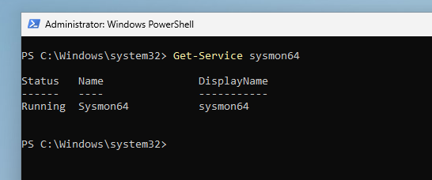

# EDR Attack and Defense
 
 ### Project Overview -
This lab simulates a real-world cyber attack and endpoint detection and response scenario. I use virtual machines to represent both the attacker and victim systems. The attack machine deploys 'Sliver' as a C2 framework to target a Windows endpoint, while 'LimaCharlie' is employed as the EDR solution on the victim machine to detect and respond to the threat.

### Setup

The first step in the lab involves setting up the virtual environment. The attack machine is configured to run on an Ubuntu Server, while the endpoint operates on Windows 11. An additional Ubuntu virtual machine is used to SSH into the Ubuntu Server. After configuring the machines, Sysmon is enabled on the Windows machine, and LimaCharlie is deployed as the EDR solution. LimaCharlie is linked to the Windows endpoint via a sensor and is configured to import and analyze Sysmon logs.

### The Attack and Defense

The initial step involves generating the payload using Sliver and implanting the malware on the Windows host machine. Once the malware is executed on the endpoint, a command and control session is established.

Now that a live session is established between the two machines, the attack machine can begin probing the system by checking privileges, gathering host information, and assessing the security measures in place on the host.

Now looking within LimaCharlie, I can now observe telemetry from the attacker and identify the payload being used.

Now on the attack machine, I can simulate a credential-stealing attack by dumping the LSASS memory.

Back inside of LimaCharlie, I can review the sensors, monitor the telemetry, and write rules to detect sensitive processes.

Now instead of just detecting attacks I can now use LimaCharlie to write a rule that detects and blocks attacks originating from the Sliver server. On the Ubuntu machine, I simulate parts of a ransomware attack by attempting to delete volume shadow copies. I then view the telemetry in LimaCharlie and create a rule to block the attack entirely. Once the rule is implemented, the Ubuntu machine will prevent the same type of attack.

